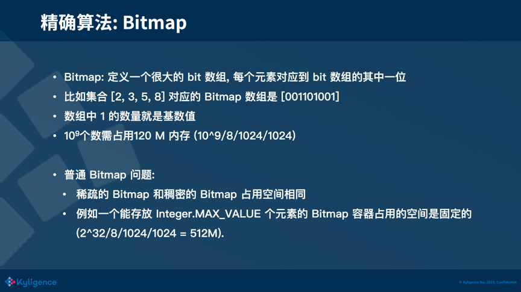

[TOC]

## 1 精确算法

### 1.1 Bitmap

利用了 Bitmap 的原理。Bitmap 也称之为 Bitset，它本质上是定义了一个很大的 bit 数组，每个元素对应到 bit  数组的其中一位。例如有一个集合［2，3，5，8］对应的 Bitmap 数组是［001101001］，集合中的 2 对应到数组 index 为 2 的位置，3 对应到 index 为 3 的位置，下同，得到的这样一个数组，我们就称之为 Bitmap。很直观的，数组中 1  的数量就是集合的基数。追本溯源，我们的目的是用更小的存储去表示更多的信息，而在计算机最小的信息单位是 bit，如果能够用一个 bit  来表示集合中的一个元素，比起原始元素，可以节省非常多的存储。

### 1.2 Roaring Bitmap

以存放 Integer 值的 Bitmap 来举例，Roaring Bitmap 把一个 32 位的 Integer 划分为高 16 位和低  16 位，取高 16 位找到该条数据所对应的 key，每个 key 都有自己的一个 Container。我们把剩余的低 16 位放入该  Container 中。依据不同的场景，有 3 种不同的 Container，分别是 Array Container、Bitmap  Container 和 Run Container。

元素个数达到 4096 之前，选用 Array Container 的收益是最好的，当元素个数超过了 4096 时，Array  Container 所占用的空间还是线性的增长，而 Bitmap Container 的存储占用则与数据量无关，这个时候 Bitmap  Container 的收益就会更好。而 Run Container 占用的存储大小完全看数据的连续性, 因此只能画出一个上下限范围 [4  Bytes, 128 KB]。

#### 1.2.1 Array Container

Array Container 适合存放稀疏的数据，Array Container 内部的数据结构是一个 short array，这个  array 是有序的，方便查找。数组初始容量为 4，数组最大容量为 4096。超过最大容量 4096 时，会转换为 Bitmap  Container。这边举例来说明数据放入一个 Array Container 的过程：有 0xFFFF0000 和 0xFFFF0001  两个数需要放到 Bitmap 中, 它们的前 16 位都是 FFFF，所以他们是同一个 key，它们的后 16 位存放在同一个  Container 中 ; 它们的后 16 位分别是 0 和 1, 在 Array Container 的数组中分别保存 0 和 1  就可以了，相较于原始的 Bitmap 需要占用 512M 内存来存储这两个数，这种存放实际只占用了 2+4=6 个字节（key 占 2  Bytes，两个 value 占 4 Bytes，不考虑数组的初始容量）。

#### 1.2.2 Bitmap Container

Bitmap Container其原理就是上文说的 Bitmap。它的数据结构是一个 long 的数组，数组容量固定为 1024，和上文的  Array Container 不同，Array Container 是一个动态扩容的数组。这边推导下 1024 这个值：由于每个  Container 还需处理剩余的后 16 位数据，使用 Bitmap 来存储需要 8192 Bytes（2^16/8）, 而一个 long  值占 8 个 Bytes，所以一共需要 1024（8192/8）个 long 值。所以一个 Bitmap container 固定占用内存 8  KB（1024 * 8 Byte）。当 Array Container 中元素到 4096 个时，也恰好占用 8  k（4096*2Bytes）的空间，正好等于 Bitmap 所占用的 8 KB。而当你存放的元素个数超过 4096 的时候，Array  Container 的大小占用还是会线性的增长，但是 Bitmap Container 的内存空间并不会增长，始终还是占用 8 K，所以当  Array Container 超过最大容量（DEFAULT_MAX_SIZE）会转换为 Bitmap Container。

#### 1.2.3 Run Container

Run Container适用于存放连续的数据。比如说 1 到 100，一共 100  个数，这种类型的数据称为连续的数据。这边的 Run 指的是 Run Length  Encoding（RLE），它对连续数据有比较好的压缩效果。原理是对于连续出现的数字, 只记录初始数字和后续数量。例如: 对于 [11, 12, 13, 14, 15, 21, 22]，会被记录为 11, 4, 21, 1。很显然，该 Container  的存储占用与数据的分布紧密相关。最好情况是如果数据是连续分布的，就算是存放 65536 个元素，也只会占用 2 个  short。而最坏的情况就是当数据全部不连续的时候，会占用 128 KB 内存。

## 2 近似算法

### 2.1 HyperLogLog

HLL 算法需要完整遍历所有元素一次，而非多次或采样；该算法只能计算集合中有多少个不重复的元素，不能给出每个元素的出现次数或是判断一个元素是否之前出现过；多个使用 HLL 统计出的基数值可以融合。

HLL 算法有着非常优异的空间复杂度，可以看到它的空间占用随着基数值的增长并没有变化。HLL 后面不同的数字代表着不同的精度，数字越大，精度越高，占用的空间也越大，可以认为 HLL 的空间占用只和精度成正相关。

##### 原理

HLL 算法的原理会涉及到比较多的数学知识。举一个生活中的例子来帮助大家理解 HLL  算法的原理：比如你在进行一个实验，内容是不停地抛硬币，记录你连续抛到正面的次数（这是数学中的伯努利过程，感兴趣同学可以自行研究下）；如果你最多的连抛正面记录是 3 次，那可以想象你并没有做这个实验太多次，如果你最长的连抛正面记录是 20 次，那你可能进行了这个实验上千次。一种理论上存在的情况是，你非常幸运，第一次进行这个实验就连抛了 20 次正面，我们也会认为你进行了很多次这个实验才得到了这个记录，这就会导致错误的预估；改进的方式是请 10  位同学进行这项实验，这样就可以观察到更多的样本数据，降低出现上述情况的概率。这就是 HLL 算法的核心思想。

##### 具体实现

HLL 会通过一个 hash 函数来求出集合中所有元素的 hash 值（二进制表示的 hash  值，就可以理解为一串抛硬币正反面结果的序列），得到一个 hash 值的集合，然后找出该 hash 值集合中，第一个 1  出现的最晚的位置。例如有集合为 [010, 100, 001], 集合中元素的第一个 1 出现的位置分别为 2, 1,  3，可以得到里面最大的值为 3，故该集合中第一个 1 出现的最晚的位置为 3。因为每个位置上出现 1 的概率都是  1/2，所以我们可以做一个简单的推断，该集合中有 8 个不重复的元素。

可以看到这种简单的推断计算出来集合的基数值是有较大的偏差的，那如何来减少偏差呢？正如我上面的例子里说的一样，HLL 通过多次的进行试验来减少误差。HLL 使用了分桶的思想，上文中我们一直有提到一个精度的概念，比如说  HLL(10)，这个 10 代表的就是取该元素对应 Hash 值二进制的后 10 位，计算出记录对应的桶，桶中会记录一个数字，代表对应到该桶的  hash 值的第一个 1 出现的最晚的位置。如上图，该 hash 值的后 10 位的 hash 值是 0000001001，转成 10 进制是  9，对应第 9 号桶，而该 hash 值第一个 1 出现的位置是第 6 位，比原先 9 号桶中的数字大，故把 9 号桶中的数字更新为  6。可以看到桶的个数越多，HLL 算法的精度就越高，HLL(10) 有 1024(210) 个桶，HLL(16) 有 65536(216)  个桶。同样的，桶的个数越多，所占用的空间也会越大。

