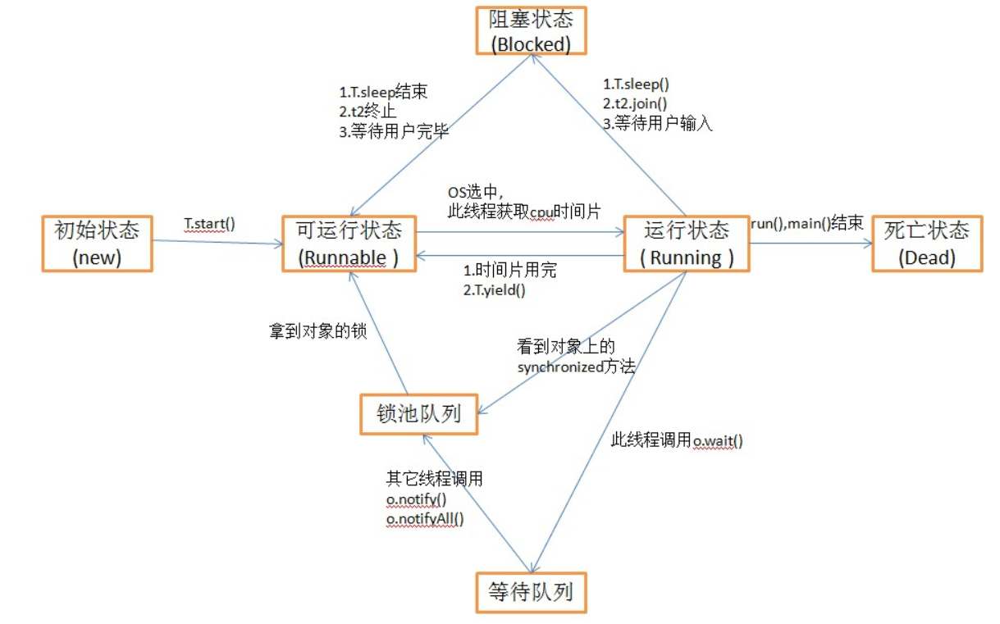

# thread

[TOC]

## 1. JVM多线程
JAVA虚拟机的多线程是通过线程轮流切换并分配处理器执行时间的方式实现的，在任何一个确定的时刻，一个内核都只会执行一条线程中的指令。

## 2. 创建线程
- 继承 Thread
- 实现 Runnable
  - 优点：
    1. 避免单继承特性带来的缺陷
    2. 适合多个线程处理同一资源的情况
  

在多线程下，主线程开启一个异步线程运行任务时，主线程会将共享对象放到异步线程可以访问的共享内存里面，待开启异步线程后主线程继续自己的任务，而异步线程则会从共享内存中访问到主线程创建的共享对象，进行异步处理，当异步任务执行异常时会被异步线程捕获，并且不会传递给主调用线程，会导致内部异常冒泡到线程根，并使线程关闭，任务状态完全丢失。

## 3. 线程状态
参考代码: org.lucas.example.foundation.thread.demo.thread.ThreadDemo

- NEW(新创建了一个线程对象):线程对象创建未start()之前就属于NEW状态.
- RUNNABLE(可运行;准备就绪):线程对象创建后，其他线程(比如main线程）调用了该对象的start()方法。该状态的线程位于可运行线程池中，等待被线程调度选中，获取cpu 的使用权 。
- 阻塞状态:阻塞状态是指线程因为某种原因放弃了cpu 使用权，也即让出了cpu time slice，暂时停止运行。直到线程进入可运行(runnable)状态，才有机会再次获得cpu time slice 转到运行(running)状态。阻塞的情况分三种：
  - WAITING(等待阻塞):运行(running)的线程执行Object.wait()/Thread.join()方法，JVM会把该线程放入等待队列(waiting queue)中,不再参与调度。notify/notify能让线程结束waiting状态.
  - BLOCKED(同步阻塞):运行(running)的线程在获取对象的同步锁时，若该同步锁被别的线程占用，则JVM会把该线程放入锁池(lock pool)中,blocked是线程被动阻塞，waiting是线程主动阻塞.
  - TIMED_WAITING(等待阻塞):运行(running)的线程执行Thread.sleep(long ms)或Thread.join(long ms)方法，或者发出了I/O请求时，JVM会把该线程置为阻塞状态。当sleep(long ms)状态超时、join(long ms)等待线程终止或者超时、或者I/O处理完毕时，线程重新转入可运行(runnable)状态。
- TERMINATED(死亡状态): 线程run()、main() 方法执行结束，或者因异常退出了run()方法，则该线程结束生命周期。死亡的线程不可再次复生。在一个死去的线程上调用start()方法，会抛出java.lang.IllegalThreadStateException异常。

## 4. 内存可见性
所有线程都能看到共享内存的最新状态。

### 4.1. 原子操作保证内存可见性
1. lock：作用于主内存，把变量标识为线程独占状态。
2. unlock：作用于主内存，解除独占状态。
3. read：作用主内存，把一个变量的值从主内存传输到线程的工作内存。
4. load：作用于工作内存，把read操作传过来的变量值放入工作内存的变量副本中。
5. use：作用工作内存，把工作内存当中的一个变量值传给执行引擎。
6. assign：作用工作内存，把一个从执行引擎接收到的值赋值给工作内存的变量。
7. store：作用于工作内存的变量，把工作内存的一个变量的值传送到主内存中。
8. write：作用于主内存的变量，把store操作传来的变量的值放入主内存的变量中

### 4.2. volatile
每次写这个变量时会将该变量工作内存的值写入主内存中。读取时，会将主内存中的变量读取到工作内存中

系统不允许一个 volatile 的写操作前面的读或者写操作重排序，一个volatile的读操作不能和后面的读或者写操作重排序。