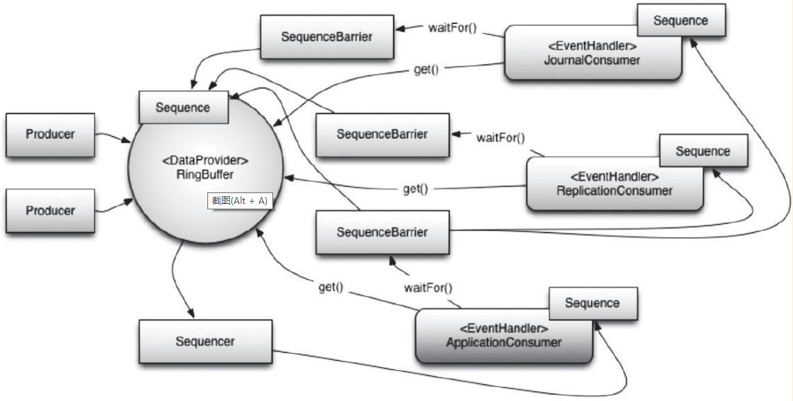

[toc]

## 1 关键功能

- Disruptor中的同一个消息会向所有消费者发送，即多播能力（MulticastEvent）。当有多个消费者在同一个Disruptor上监听事件时，所有事件都会发布给所有消费者。
- 为事件预先分配内存（EventPreallocation），避免运行时因频繁地进行垃圾回收与内存分配而增加开销。在低延迟系统中，必须减少或移除运行时内存分配；在基于Java的系统中，目的是减少由于垃圾收集导致的系统停顿。为了支持这一点，用户可以预先为Disruptor中的事件分配其所需的存储空间（也就是声明RingBuffer的大小）。在构造RingBuffer期间，EventFactory由用户提供，并将在Disruptor的RingBuffer中每个事件元素创建时被调用。将新数据发布到Disruptor时，API将允许用户获取构造的对象，以便调用方法或更新该存储对象上的字段，Disruptor保证这些操作只要正确实现就是并发安全的。
- 可选择无锁（OptionallyLock-free），所有内存可见性和正确性保证都是使用内存屏障（体现为volatile关键字）或CAS操作实现的。在Disruptor的实现中只有一种情况需要实际锁定——当使用BlockingWaitStrategy策略时，这仅仅是为了使用条件变量，以便在等待新事件到达时parked消费线程。许多低延迟系统将使用忙等待（busy-wait）来避免使用条件可能引起的抖动，但是大量在系统繁忙等待的操作可能导致性能显著下降，尤其是在CPU资源严重受限的情况下。Disruptor通过使用两阶段协议，让多个线程可同时修改不同元素。消费元素时只能读取到已经提交的元素。在Disruptor中某个线程要访问RingBuffer某个序列号下对应的元素时，要先通过CAS操作获取对应元素的所有权(第一阶段)，然后通过序列号获取对应元素对象并对其属性进行修改，最后再发布元素（第二阶段），只有发布后的元素才能被消费者读取。当多个线程写入元素时，它们都会先执行CAS操作，获取到RingBuffer中某一个元素的所有权，然后可以并发对自己的元素进行修改。注意：只有序列号小的元素发布后，后面的元素才能发布。（其实在单生产者的情况下可以省去CAS的开销，因为在这种情况下，只有一个线程来请求RingBuffer的数据，生产者数据使用普通的long类型变量即可，在创建的时候指定是单生产者还是多生产者，如果是单生产者模型，指定生产者模式为ProducerType.SINGLE效果会更好）
- 缓存行填充，避免伪共享（preventfalsesharing）。Cache是按行进行存储的，其中每一行称为一个Cache行，Cache行是Cache与主内存进行数据交换的单位，大小一般为2的幂次数字节。CPU访问某个变量时，首先会看CPU Cache内是否有该变量，如果有则直接获取，否则就去主内存里获取该变量，然后把该变量所在内存区域的一个Cache行大小的内存复制到Cache。由于存放到Cache行的是内存块，而不是单个变量，所以可能会把多个变量存放到了一个Cache行。当多个线程同时修改一个Cache行里的多个变量时，由于同时只能有一个线程操作缓存行，因而相比每个变量放到一个Cache行性能有所下降，这就是伪共享。Disruptor通过缓存行填充，让数组中的每个元素独占一个缓存行从而解决伪共享问题。
  - e.g.变量x，y同时被放到了CPU的一级缓存和二级缓存，当线程1使用CPU1对变量x进行更新时，首先会修改CPU1的一级缓存变量x所在的缓存行，这时候缓存一致性协议会导致CPU2中的变量x对应的缓存行失效，那么线程2写入变量x的时候就只能去二级缓存查找，这就破坏了一级缓存，而一级缓存比二级缓存更快，这里也说明了多个线程不可能同时去修改自己所使用的CPU中缓存行中相同缓存行里面的变量。更坏的情况下CPU只能有一级缓存，会导致频繁地直接访问主内存。

## 2 组件

- RingBuffer：环形缓冲区，通常被认为是Disruptor的核心，从3.0版本开始，RingBuffer仅负责存储和更新Disruptor中的数据（事件）。
- Sequence：Disruptor 使用 Sequence 作为识别特定组件所在位置的方法。每个消费者（EventProcessor）都像Disruptor本身一样维护一个Sequence。大多数并发代码依赖于这些Sequence值的移动，因此Sequence支持AtomicLong的许多当前功能。事实上，3.0版本与2.0版本之间唯一真正的区别是防止了Sequence和其他变量之间出现伪共享。
- Sequencer：Sequencer是Disruptor的真正核心。该接口的2个实现（单生产者和多生产者）实现了所有并发算法，用于在生产者和消费者之间快速、正确地传递数据。
- SequenceBarrier：序列屏障，由Sequencer产生，包含对Sequencer中主要发布者的序列Sequence和任何依赖的消费者的序列Sequence的引用。它包含了确定是否有可供消费者处理的事件的逻辑。
- WaitStrategy：等待策略，确定消费者如何等待生产者将事件放入Disruptor。
- Event：从生产者传递给消费者的数据单位。事件没有特定的代码表示，因为它完全由用户定义。
- EventProcessor：用于处理来自Disruptor的事件的主事件循环，并拥有消费者序列的所有权。其有一个名为BatchEventProcessor的实现，它包含事件循环的有效实现，并将回调使用者提供的EventHandler接口实现（在线程池内运行BatchEventProcessor的run方法）。
- EventHandler：由用户实现并代表Disruptor的消费者的接口。
- Producer：调用Disruptor以将事件放入队列的用户代码。这个概念在代码中也没有具体表示。

## 2 处理流程

Producer向Disruptor的RingBuffer中写入事件，消费者JournalConsumer和ReplicationConsumer（EventHandler）使用多播方式同时消费RingBuffer中的每一个元素，两者都有各自的SequenceBarrier用来控制当前可消费RingBuffer中的哪一个事件，并且当不存在可用事件时如何处理。消费者ApplicationConsumer则是等JournalConsumer和ReplicationConsumer对同一个元素处理完毕后，再处理该元素。

.png)

每个消费者持有自己的当前消费序号，由于是环形buffer，因而生产者写入事件时要看序号最小的消费者序号，以避免覆盖还没有被消费的事件，另外Consumer3只能消费已经被Consumer1、Consumer2都处理过的事件。