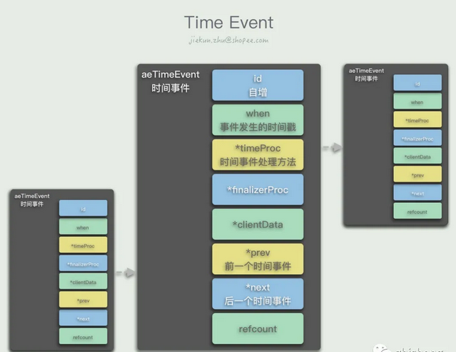
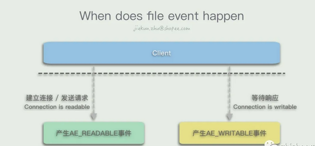

[TOC]

## 1 时间事件

**时间事件也就是到了一定时间会发生的事件**，在Redis中它们被记录成一个链表，每次创建新的时间事件的时候，都会在链表头部插入一个`aeTimeEvent`节点，其中保存了该事件会在何时发生，需要调用什么样的方法处理。遍历整个链表我们可以知道离最近要发生的时间事件还有多久，因为链表里面的节点按照自增id顺序排列，而在发生时间的维度上时乱序的。

## 2 文件事件

**文件事件可以看作I/O引起的事件**，客户端发送命令会让服务端产生一个读I/O，对应一个读事件；同样当客户端等待服务端消息的时候需要变得可写，让服务端写入内容，因此会对应一个写事件。`AE_READABLE`事件会在客户端建立连接、发送命令或其他连接变得可读的时候发生，而`AE_WRITABLE`事件则会在客户端连接变得可写的时候发生。如果同时发生了两种事件，Redis会优先处理`AE_READABLE`事件。

