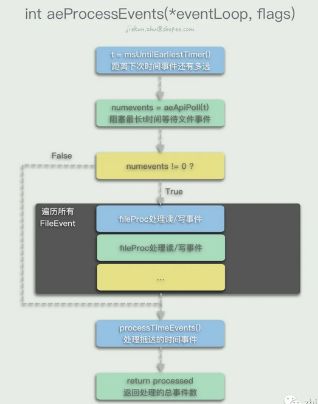
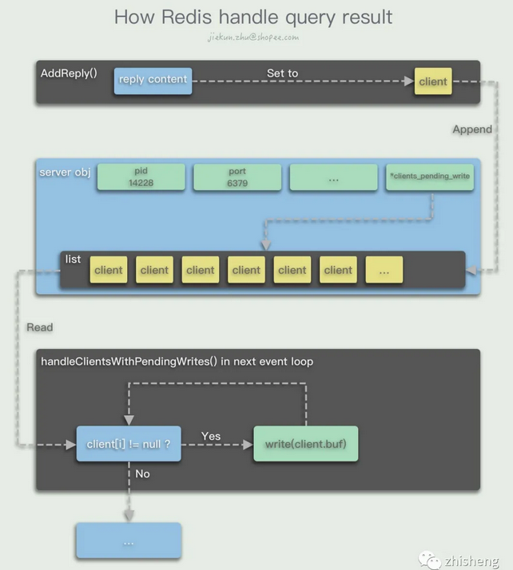

[TOC]

## 1 处理流程

### 1.1 事件处理流程

Redis首先检查下一次的时间事件会在什么时候发生，在还没有时间事件发生的这段时间内，可以调用多路复用的API `aeApiPoll()`阻塞并等待文件事件的发生。如果没有文件事件发生，那么超时后返回0，否则返回已发生的文件事件数量`numevents`。在有文件事件可处理的情况下，Redis会调用`AE_READABLE`事件的`rfileProc`方法以及`AE_WRITABLE`事件的`wfileProc`方法进行处理。在完成前面的处理后，Redis会继续调用`processTimeEvents()`处理时间事件。遍历整个时间事件链表，如果此时已经过了一段时间（阻塞等待或处理文件事件耗时），有时间事件发生，那么就调用对应时间事件的`timeProc`方法，将所有已经过时的时间事件处理掉。如果执行了文件事件之后还没有到最近的时间事件发生点，那么本次`aeMain()`循环中将没有时间事件被执行，进入下一次循环。

### 1.2 命令处理流程

客户端连接上Redis的时候，通过执行`connSetReadHandler(conn, readQueryFromClient)`，设置了当读事件发生时，使用`readQueryFromClient()`作为读事件的Handler。在收到客户端的命令请求时，Redis进行一些检查和统计后，调用`read()`方法将连接中的数据读取进`client.querybuf`消息缓冲区中。然后进入`processInputBuffer(c)`开始读取输入缓冲区中的消息，最后进入`processCommand(c)`开始处理输入的命令。在命令执行得到结果后，首先会存放在`client.buf`中，并且调用调用`addReply(client *c, robj *obj)`方法，将这个`client`对象追加到`server.clients_pending_write`列表中。此时当次的命令，或者说`AE_READABLE`事件就已经基本处理完毕了，除了一些额外的统计数据、后处理以外，不会再进行发送响应消息的动作。在当前`aeProcessEvents()`方法结束后，进入**下一次的循环**，第二次循环调用I/O多路复用接口等待文件事件发生前，Redis会检查`server.clients_pending_write`是否有客户端需要进行回复，若有，遍历指向各个待回复客户端的`server.clients_pending_write`列表，逐个将客户端从中删除，并将待回复的内容通过`writeToClient(c,0)`回复出去。

